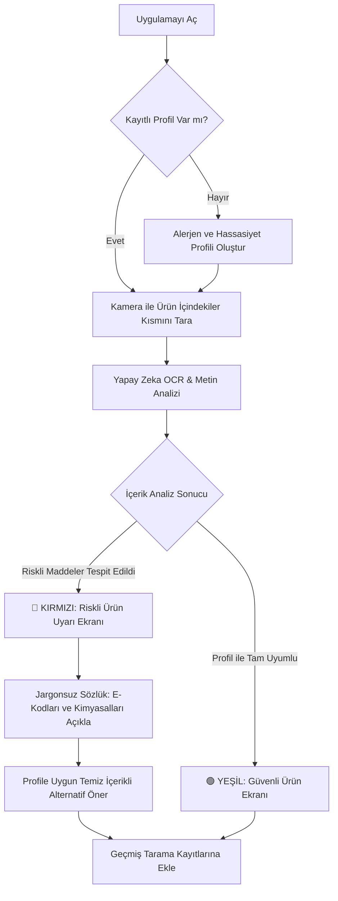

# NutriLens AI

*Güvenli Gıda, Bilinçli Tüketim.*

---

  
<b>👥 Ekip Üyeleri ve Rol Dağılımı</b>

   

| İsim | Rol | LinkedIn | GitHub |
| :--- | :--- | :---: | :---: |
| **Ünal Pilavcı** | Product Owner |  |  |
| **Nisa Gündüz** | Scrum Master |  |  |
| **Gülşah Cihanker** | No Code Low Code Developer |  |  |
| **Mehmet Fatih Efe** | No Code Low Code Developer |  |  |
| **Beyza Demirbaş** | No Code Low Code Developer |  |  |

  
<b>💡 Ürün Bilgileri</b>

   

  ### 📌 Ürün İsmi
  **NutriLens AI**

  

  ### 📝 Ürün Açıklaması

  > 🔴 **⚠️ PROBLEM**
  >
  > Market raflarındaki paketli ürünlerin arkasındaki içindekiler listeleri genellikle mikroskobik puntolarla, Latince kimyasal isimlerle ve karmaşık E-kodlarıyla doludur. Çölyak, laktoz intoleransı veya kuruyemiş alerjisi olan bireyler; çocuğuna temiz içerikli gıda yedirmek isteyen ebeveynler; sporcular ve diyet yapanlar için bu etiketleri her seferinde okumak hem zaman kaybettirir hem de hata payı bazı durumlarda hayati risk taşır. Piyasadaki barkod okuyucu uygulamalar ise ürün kendi veritabanlarında kayıtlı değilse çalışmaz veya sadece kalori/makro bilgisiyle sınırlı kalır.

   

  > 🟢 **✅ ÇÖZÜM**
  >
  > NutriLens AI, ürünün “İçindekiler” kısmının fotoğrafını yapay zeka ile saniyeler içinde analiz eden bir mobil uygulamadır. Kullanıcı kendi alerjen ve hassasiyet profilini (gluten, laktoz, MSG, palm yağı vb.) bir kez oluşturur; sonrasında herhangi bir üründe kamerayla tarama yaptığında uygulama anında **KIRMIZI (Riskli)** veya **YEŞİL (Güvenli)** uyarısı verir ve karmaşık kimyasal isimleri/E-kodlarını sade bir dille açıklar. Üstelik uygulama, riskli bulunan (kırmızı) ürünlerin yerine kullanıcının profiline tam uyum sağlayan temiz içerikli alternatif ürün önerileri sunarak alışveriş deneyimini kesintisiz ve güvenli bir çözüme kavuşturur.

  

  ### ⚙️ Ürün Özellikleri

  | 🧩 Özellik | 📄 Açıklama / Teknoloji |
  | :--- | :--- |
  | 👤 **Kişiselleştirilmiş Profil** | Alerjen/hassasiyet profili oluşturma (gluten, laktoz, MSG, palm yağı vb.) |
  | 📷 **Anlık Tarama** | Kamera ile içindekiler listesini tarama (Vision AI + OCR) |
  | 🚦 **Renk Kodlu Uyarı** | Renk kodlu sonuç ekranı (🔴 Kırmızı: Riskli / 🟢 Yeşil: Güvenli) |
  | 📖 **Jargonsuz Sözlük** | E-kodları ve kimyasal isimleri sade dilde açıklama |
  | 🕓 **Geçmiş Kayıtlar** | Geçmiş tarama kayıtlarını saklama |

  

  ### 🎯 Hedef Kitle

  | 👥 Kitle | 🔎 Açıklama |
  | :--- | :--- |
  | 🥜 **Alerji & İntolerans** | Gıda alerjisi ve intoleransı olan bireyler (çölyak, laktoz, kuruyemiş vb.) |
  | 👨‍👩‍👧 **Bilinçli Ebeveynler** | Çocuklarının beslenmesini takip eden ebeveynler |
  | 🏋️ **Sporcular** | Sporcular ve fitness tutkunları |
  | 🥗 **Diyet & Kilo Yönetimi** | Ketojenik, vegan, vejetaryen vb. süreçtekiler |
  | 🌿 **Temiz Beslenme** | Clean eating odaklı tüketiciler |
  | 📚 **Gıda Okuryazarları** | 15 - 65 yaş arası gıda okuryazarlığına önem veren geniş kitle |

  

  ### 🗺️ Kullanıcı Akış Şeması (User Journey)
  

  

  ### 🔗 Product Backlog URL
  [Miro Backlog Board](#) *(Buraya kendi Miro panonuzun linkini ekleyebilirsiniz)*

  
<b>🚀 Sprint 1</b>

   

  - **Backlog düzeni ve Story seçimleri:** Backlog oluşturulurken ekipteki geliştiricilerin görüşleri esas alındı ve uygulamanın çalışır bir MVP haline gelebilmesi için olmazsa olmaz kabul edilen temel akış netleştirildi: profil oluşturma, kamera ile tarama, OCR analizi ve uyarı ekranı. Proje toplamda üç sprintlik bir süreç olarak planlandığından ve henüz ekibin gerçek iş temposu test edilmediğinden, ilk sprintte temkinli davranılarak backlog'un yaklaşık üçte biri kadarlık bir kısmının alınması tercih edildi. Bu kapsamda Sprint 1'e, projenin iskeletini oluşturan story'ler dahil edildi: profil ekranı, kamera entegrasyonu ve Gemini API üzerinden OCR bağlantısı. Sprint 1 sonunda ekibin gösterdiği performans doğrultusunda, kalan sprintlerdeki görev yoğunluğu artırılabilir ya da mevcut planlamanın dışına çıkılarak ileriki sprintlere ait bazı story'ler öne çekilebilir.
  - **Daily Scrum:** Daily Scrum toplantılarının zamansal sebeplerden ötürü Slack üzerinden yapılmasına karar verilmiştir. Daily Scrum toplantısı örneği jpeg veya word olarak Readme'de tarafımızdan paylaşılmaktadır: *[Sprint 1 Daily Scrum Chats Linki]*
  - **Sprint board update:** Sprint board screenshotları: *[Buraya ekran görüntüsü ekleyebilirsiniz]*
  - **Ürün Durumu:** 

  
  - **Sprint Review:** - Kullanıcının kamerayla çektiği ürün içindekiler fotoğrafını otonom olarak işleyip, Gemini AI ile OCR ve risk analizi yaparak kırmızı/yeşil sonucu üreten çalışan bir MVP veri hattı kurmak.
    - Sprint Review katılımcıları: Ünal Pilavcı, Nisa Gündüz, Gülşah Cihanker, Mehmet Fatif Efe, Beyza Demirbaş
  - **Sprint Retrospective:**
    - Takım içindeki görev dağılımıyla ilgili düzenleme yapılması kararı alınmıştır.
    - Tahmin puanları gözden geçirilmeli ve sprint planlama toplantılarında gerekli geri bildirimlerin developer'lar tarafından verildiğine emin olunmalı.
    - Unit test'ler için ayrılan efor/saat arttırılmalı.

  
<b>🚀 Sprint 2</b>

   
  
  *(Sprint 2 notları, ekran görüntüleri ve toplantı detayları bu alana eklenecektir.)*
  

  
<b>🚀 Sprint 3</b>

   
  
  *(Sprint 3 notları, ekran görüntüleri ve toplantı detayları bu alana eklenecektir.)*
  

