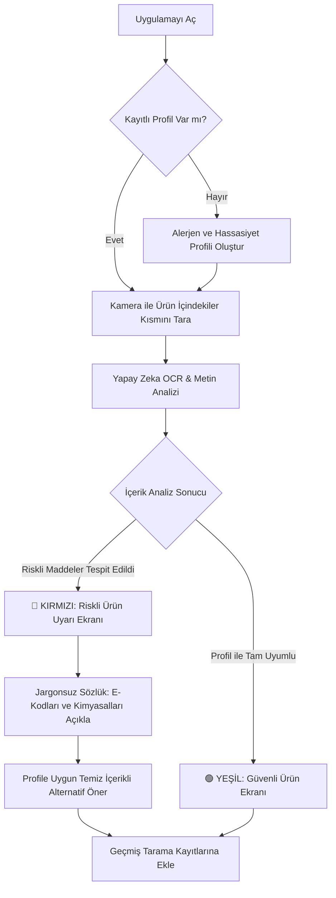
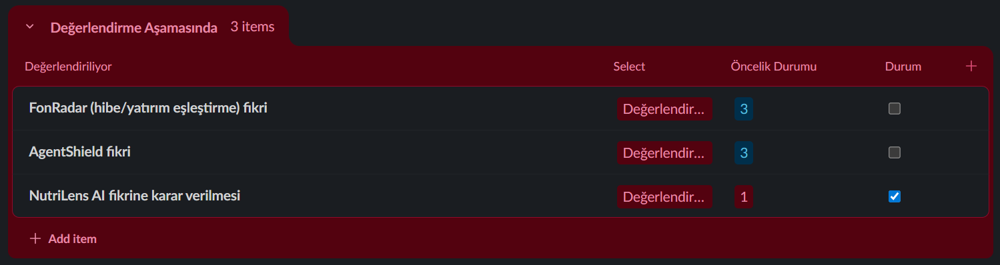
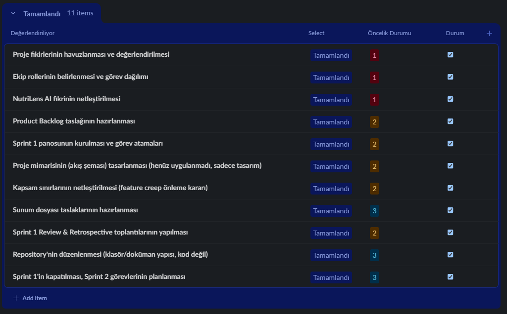

# NutriLens AI

*Güvenli Gıda, Bilinçli Tüketim.*

---

  
<b>👥 Ekip Üyeleri ve Rol Dağılımı</b>

   

| İsim | Rol | LinkedIn | GitHub |
| :--- | :--- | :---: | :---: |
| **Ünal Pilavcı** | Product Owner |  |  |
| **Nisa Gündüz** | Scrum Master |  |  |
| **Gülşah Cihanker** | No Code Low Code Developer |  |  |
| **Mehmet Fatih Efe** | No Code Low Code Developer |  |  |
| **Emine Beyza Demirbaş** | No Code Low Code Developer |  |  |

  
<b>💡 Ürün Bilgileri</b>

   

  ### 📌 Ürün İsmi
  **NutriLens AI**

  

  ### 📝 Ürün Açıklaması

  > 🔴 **⚠️ PROBLEM**
  >
  > Market raflarındaki paketli ürünlerin arkasındaki içindekiler listeleri genellikle mikroskobik puntolarla, Latince kimyasal isimlerle ve karmaşık E-kodlarıyla doludur. Çölyak, laktoz intoleransı veya kuruyemiş alerjisi olan bireyler; çocuğuna temiz içerikli gıda yedirmek isteyen ebeveynler; sporcular ve diyet yapanlar için bu etiketleri her seferinde okumak hem zaman kaybettirir hem de hata payı bazı durumlarda hayati risk taşır. Piyasadaki barkod okuyucu uygulamalar ise ürün kendi veritabanlarında kayıtlı değilse çalışmaz veya sadece kalori/makro bilgisiyle sınırlı kalır.

   

  > 🟢 **✅ ÇÖZÜM**
  >
  > NutriLens AI, ürünün “İçindekiler” kısmının fotoğrafını yapay zeka ile saniyeler içinde analiz eden bir mobil uygulamadır. Kullanıcı kendi alerjen ve hassasiyet profilini (gluten, laktoz, MSG, palm yağı vb.) bir kez oluşturur; sonrasında herhangi bir üründe kamerayla tarama yaptığında uygulama anında **KIRMIZI (Riskli)** veya **YEŞİL (Güvenli)** uyarısı verir ve karmaşık kimyasal isimleri/E-kodlarını sade bir dille açıklar. Üstelik uygulama, riskli bulunan (kırmızı) ürünlerin yerine kullanıcının profiline tam uyum sağlayan temiz içerikli alternatif ürün önerileri sunarak alışveriş deneyimini kesintisiz ve güvenli bir çözüme kavuşturur.

  

  ### ⚙️ Ürün Özellikleri

  | 🧩 Özellik | 📄 Açıklama / Teknoloji |
  | :--- | :--- |
  | 👤 **Kişiselleştirilmiş Profil** | Alerjen/hassasiyet profili oluşturma (gluten, laktoz, MSG, palm yağı vb.) |
  | 📷 **Anlık Tarama** | Kamera ile içindekiler listesini tarama (Vision AI + OCR) |
  | 🚦 **Renk Kodlu Uyarı** | Renk kodlu sonuç ekranı (🔴 Kırmızı: Riskli / 🟢 Yeşil: Güvenli) |
  | 📖 **Jargonsuz Sözlük** | E-kodları ve kimyasal isimleri sade dilde açıklama |
  | 🕓 **Geçmiş Kayıtlar** | Geçmiş tarama kayıtlarını saklama |

  

  ### 🎯 Hedef Kitle

  | 👥 Kitle | 🔎 Açıklama |
  | :--- | :--- |
  | 🥜 **Alerji & İntolerans** | Gıda alerjisi ve intoleransı olan bireyler (çölyak, laktoz, kuruyemiş vb.) |
  | 👨‍👩‍👧 **Bilinçli Ebeveynler** | Çocuklarının beslenmesini takip eden ebeveynler |
  | 🏋️ **Sporcular** | Sporcular ve fitness tutkunları |
  | 🥗 **Diyet & Kilo Yönetimi** | Ketojenik, vegan, vejetaryen vb. süreçtekiler |
  | 🌿 **Temiz Beslenme** | Clean eating odaklı tüketiciler |
  | 📚 **Gıda Okuryazarları** | 15 - 65 yaş arası gıda okuryazarlığına önem veren geniş kitle |

  

  ### 🗺️ Kullanıcı Akış Şeması (User Journey)
  

  
<b>🚀 Sprint 1</b>

   

  - **Backlog düzeni ve Story seçimleri:** Backlog oluşturulurken ekipteki geliştiricilerin görüşleri esas alındı ve uygulamanın çalışır bir MVP haline gelebilmesi için olmazsa olmaz kabul edilen temel akış netleştirildi: profil oluşturma, kamera ile tarama, OCR analizi ve uyarı ekranı. Proje toplamda üç sprintlik bir süreç olarak planlandığından ve henüz ekibin gerçek iş temposu test edilmediğinden, ilk sprintte temkinli davranılarak backlog'un yaklaşık üçte biri kadarlık bir kısmının alınması tercih edildi. Bu kapsamda Sprint 1'e, projenin iskeletini oluşturan story'ler dahil edildi: profil ekranı, kamera entegrasyonu ve Gemini API üzerinden OCR bağlantısı. Sprint 1 sonunda ekibin gösterdiği performans doğrultusunda, kalan sprintlerdeki görev yoğunluğu artırılabilir ya da mevcut planlamanın dışına çıkılarak ileriki sprintlere ait bazı story'ler öne çekilebilir.

  - **🔗 Product Backlog URL:** [Slack Product Backlog Board](https://yzta.slack.com/lists/T02LKGXV98C/F0BF5A5TXNZ) 

   

  **🖼️ Product Backlog Ekran Görüntüleri**

  

    
  

  

  

    
  

  

  

    
  

   

   

  **📋 Sprint 1 Daily Scrum Notları (17 GÜN)**

  | Gün | Tarih | Açıklama |
  |-----|-------|----------|
  | 1. GÜN | 19 Haziran 2026 |  Başlangıç yayını izlendi. Karar süreçlerini hızlandırmak amacıyla tüm proje fikirleri kolektif bir listede toplandı; rol dağılımı konuşuldu. Engel: Yok. |
  | 2. GÜN | 20 Haziran 2026 |  Proje fikirleri havuzu oluşturuldu (FonRadar, AgentShield, alerjen asistanı vb.). Ekip rollerini netleştirmek ve öne çıkan fikirleri değerlendirmek üzere bir araya gelindi. Engel: Yok. |
  | 3. GÜN | 21 Haziran 2026 |  Ekip rolleri belirlendi; FonRadar (hibe/yatırım eşleştirme asistanı) ve AgentShield fikirleri değerlendirmeye alındı. İki fikrin teknik gereksinim ve zaman kısıtı analizleri yapıldı. Engel: Yok. |
  | 4. GÜN | 22 Haziran 2026 |  Teknik gereksinim analizleri tamamlandı. FonRadar'ın veri katmanı (KOSGEB/TÜBİTAK tarama, PDF ayrıştırma) ve AgentShield'in kapsamı mevcut süre/imkanlarla uyuşmadığından fikirlerin elenmesi değerlendirildi. Engel: Kritik: Değerlendirilen fikirler mevcut imkanlarla uyuşmuyor. |
  | 5. GÜN | 23 Haziran 2026 |  FonRadar ve AgentShield fikirleri elendi, NutriLens AI (alerjen/hassasiyet güvenlik asistanı) fikrine karar verildi. NutriLens AI için Product Backlog taslağı hazırlandı. Engel: Yok. |
  | 6. GÜN | 24 Haziran 2026 |  Product Backlog taslağı hazırlandı. Sprint 1 panosu kuruldu, görev atamaları ve zorluk dereceleri belirlendi. Engel: Yok. |
  | 7. GÜN | 25 Haziran 2026 |  Görev atamaları tamamlandı. Proje mimarisi (profil → foto → Gemini Vision → risk analizi → uyarı ekranı akış şeması) tasarlandı; henüz uygulanmadı, yalnızca tasarım aşamasında. Engel: Yok. |
  | 8. GÜN | 26 Haziran 2026 |  Mimari akış şeması tasarlandı. MVP altyapısı için Softr / Bubble / Make karşılaştırması yapıldı; karar henüz verilmedi, değerlendirme sürüyor. Engel: Yok. |
  | 9. GÜN | 27 Haziran 2026 |  Altyapı karşılaştırma raporu hazırlandı. Teknoloji yığını (Make.com, Gemini API, Airtable) kurulumu ile veri hattının 2. aşamada yapılacak işler olarak listelenmesine karar verildi. Engel: Yok. |
  | 10. GÜN | 28 Haziran 2026 |  2. aşamada yapılacak işler (veri hattı, Türkçe alerjen sözlüğü, OCR/Gemini Vision entegrasyonu, barkod ve restoran menüsü modülleri) netleştirildi. Ekip içi senkronizasyonu korumak ve kapsamın dışına çıkılmasını (feature creep) önlemek için hizalanma toplantısı yapıldı. Engel: Kapsamın çok genişleme riski (Önlem alındı). |
  | 11. GÜN | 29 Haziran 2026 |  Kapsam sınırları netleştirildi (barkod ve restoran menüsü modülleri sonraki aşamalara ertelendi). Sunum dosyası için ön taslaklar hazırlandı. Sprint Review ve Retrospective tarihleri planlandı. Engel: Yok. |
  | 12. GÜN | 30 Haziran 2026 |  Sunum taslakları hazırlandı. Product Backlog gözden geçirildi ve düzenlendi. Engel: Yok. |
  | 13. GÜN | 1 Temmuz 2026 |  Product Backlog düzenlendi. Sprint 2'de yapılacak işler (teknoloji yığını kurulumu, veri hattı, alerjen sözlüğü, arayüz ve uyarı ekranı geliştirmeleri) belirlenip önceliklendirildi. Engel: Yok. |
  | 14. GÜN | 2 Temmuz 2026 |  Sprint 2 iş kalemleri belirlendi. Sprint 1 kapatılmadan önce panoların son senkronizasyon kontrolleri yapıldı. Engel: Yok. |
  | 15. GÜN | 3 Temmuz 2026 |  Panolar senkronize edildi. Sprint 1'in kapanışı için Review ve Retrospective toplantıları yapıldı. Engel: Yok. |
  | 16. GÜN | 4 Temmuz 2026 |  Review ve Retrospective toplantıları yapıldı. Repository düzenlendi (klasör/doküman yapısı — kod değil) ve Sprint 1 kapatıldı. Engel: Yok. |
  | 17. GÜN | 5 Temmuz 2026 |  Repo düzenlenerek Sprint 1 kapatıldı. Sprint 2 görevleri planlanarak board'a eklendi; geliştirme çalışmaları Sprint 2'de başlayacak şekilde bırakıldı. Engel: Yok. |

   

 
  - **Ürün Durumu:** 

  
  - **Sprint Review:** - Kullanıcının kamerayla çektiği ürün içindekiler fotoğrafını otonom olarak işleyip, Gemini AI ile OCR ve risk analizi yaparak kırmızı/yeşil sonucu üreten çalışan bir MVP veri hattı kurmak.
    - Sprint Review katılımcıları: Ünal Pilavcı, Nisa Gündüz, Gülşah Cihanker, Mehmet Fatif Efe, Emine Beyza Demirbaş
  - **Sprint Retrospective:**

Sprint 1, bir kod geliştirme sprint’inden çok bir yön belirleme ve planlama sprint’i olarak geçti. Ekip, Ghost Roas, FonRadar ve AgentShield gibi alternatif proje fikirlerini değerlendirdikten sonra NutriLens AI üzerinde karar kıldı; bu süreç beklenenden biraz daha uzun sürdü çünkü her fikrin hedef kitle ve teknik uygulanabilirlik açısından ayrı ayrı tartışılması gerekti. Karar netleştikten sonra backlog taslağı, sprint panosu ve görev dağılımı hızlıca oluşturuldu, bu da ekibin fikir aşamasından planlama aşamasına geçişte iyi bir tempo yakaladığını gösterdi.

MVP altyapısı konusunda (Softr / Bubble / Make karşılaştırması) henüz kesin bir karara varılmadı; bu, Sprint 2'nin ilk gününde çözülmesi gereken açık bir konu olarak kaldı. Proje mimarisi (akış şeması) tasarım aşamasında tamamlandı ancak henüz uygulamaya geçirilmedi, dolayısıyla teknik entegrasyonun (Make.com, Gemini API, Airtable) gerçek zamanlı davranışı hakkında henüz bir öngörümüz yok — bu da Sprint 2'nin en kritik risk alanı olarak değerlendirildi.

Ekip, MVP kapsamını olabildiğince sade tutma eğiliminde; barkod okuma, restoran menüsü ve tarama geçmişi gibi özellikler şimdilik ikinci öncelik olarak değerlendiriliyor. Ancak bu konudaki kapsam kararı henüz kesinleşmedi — Sprint 2'de ekip, çekirdek akışın (foto → analiz → sonuç) ne kadar hızlı oturduğuna bağlı olarak bu özelliklerden bazılarını erken devreye almayı da değerlendirebilir.

**Sprint 2 için öncelik:** MVP altyapı seçiminin ilk 1-2 gün içinde kesinleştirilmesi ve foto → Gemini Vision → risk analizi veri hattının en azından uçtan uca çalışan bir prototip olarak test edilmesi.
    

  
<b>🚀 Sprint 2</b>

   

  - **Sprint Türü:** Geliştirme Sprinti (Development-only) — Bu sprintte ayrı bir tasarım/araştırma fazı yürütülmemiş, doğrudan ürün geliştirmesi yapılmıştır.
  - **Sprint Süresi:** 15 gün (6 Temmuz – 20 Temmuz 2026)
  - **Platform:** React Native (Expo SDK 54) mobil uygulama
  - **Sprint Hedefi (Sprint Goal):** *"Prototip iskeletini; gerçek AI analizi yapan, kullanıcı verisini bulutta güvenle saklayan ve sosyal bir topluluk katmanı içeren, mağazaya yakın (store-ready) bir mobil ürüne dönüştürmek."*

  | Damar | Kapsam |
  | :---- | :---- |
  | **Deneyim (UX/UI)** | Yeni tasarım sistemi + tüm ana ekranların canlı, animasyonlu hâle getirilmesi |
  | **Zekâ (AI/Analiz)** | Foto → madde → skor → kişisel uyarı hattının uçtan uca çalışması |
  | **Altyapı (Backend)** | Supabase üzerinde auth, veri kalıcılığı, topluluk ve offline senkron |

  

  - **Backlog düzeni ve Story seçimleri:** Sprint 1'de üçte birlik temkinli bir yükleme yapılmış ve ekibin gerçek iş temposu ölçülmüştü. Sprint 2'de bu tempo doğrulandığı için backlog'un ağırlıklı kısmı bu sprinte alındı. Backlog **MoSCoW** (Must / Should / Could / Won't) yöntemiyle önceliklendirildi, her Epic kullanıcı hikâyelerine bölündü ve efor tahmini **Story Point (Fibonacci: 1-2-3-5-8-13)** ile yapıldı. "Must" kategorisindeki tasarım sistemi, tarama/AI hattı, kimlik-profil ve backend epic'leri zorunlu kapsam olarak alındı; topluluk ve çoklu dil epic'leri "Should" olarak seçildi ancak sprint içinde tamamlanabildi. FastAPI'ye taşıma, admin panel, push bildirim ve barkod tarama bilinçli olarak kapsam dışı ("Won't") bırakıldı.

  - **Sprint içi puan değerlendirmesi 16 olarak belirlenmiştir.**

  - **Puan tamamlama mantığı:** Proje boyunca tamamlanması gereken toplam backlog puanı 36'dır. Sprint 1'de hedeflenen 10 puan tamamlanmıştır. Sprint 1 ağırlıklı olarak fikir seçimi ve planlama ile geçtiğinden, geliştirmenin ana yükü Sprint 2'ye bindirilmiş ve kalan 26 puanın 16'sı bu sprinte alınmıştır. Sprint 2 sonunda **16 puanın tamamı tamamlanmış ve hedefe ulaşılmıştır.** Sprint 3'e doğrulama, güvenlik testleri ve sağlamlaştırma işleri için 10 puan bırakılmıştır.

   

  **📊 Sprint 2 Puan Tablosu**

  | Epic | Kapsam | Öncelik | Puan | Durum |
  | :---- | :---- | :---- | :---: | :---: |
  | 🎨 **EPIC 1** | Tasarım Sistemi & Görsel Kimlik | Must | 3 | ✅ Tamamlandı |
  | 📸 **EPIC 2** | Tarama & AI Analizi | Must | 4 | ✅ Tamamlandı |
  | 👤 **EPIC 3** | Kimlik, Profil & Onboarding | Must | 2 | ✅ Tamamlandı |
  | ☁️ **EPIC 4** | Backend & Veri Kalıcılığı (Supabase + RLS) | Must | 3 | ✅ Tamamlandı |
  | 🌐 **EPIC 5** | Topluluk & Keşfet | Should | 3 | ✅ Tamamlandı |
  | 🌍 **EPIC 6** | Erişilebilirlik & Çoklu Dil | Should | 1 | ✅ Tamamlandı |
  |  | **TOPLAM** |  | **16** | **✅ 16 / 16** |

   

  **📈 Proje Geneli Puan Dağılımı**

  | Sprint | Hedeflenen Puan | Tamamlanan | Kümülatif | Durum |
  | :---- | :---: | :---: | :---: | :---: |
  | Sprint 1 | 10 | 10 | 10 / 36 | ✅ Hedefe ulaşıldı |
  | **Sprint 2** | **16** | **16** | **26 / 36** | ✅ Hedefe ulaşıldı |
  | Sprint 3 | 10 | ⏳ | 36 / 36 | ⏳ Planlandı |

  Ekip içi efor tahmini ayrıca **Fibonacci Story Point** (1-2-3-5-8-13) ile yapılmış, toplam ~110 SP'lik iş çıkarılmıştır. Aşağıdaki story listesindeki SP değerleri bu iç tahmini gösterir; bootcamp puanlaması ise yukarıdaki 36'lık ölçeğe normalize edilmiştir.

  

  **📋 Sprint 2 Epic ve Story Listesi (iç efor tahmini)**

  **🎨 EPIC 1 — Tasarım Sistemi & Görsel Kimlik (Must)**

  | ID | User Story | SP | Durum |
  | :---- | :---- | :---- | :---- |
  | NL-01 | Bir kullanıcı olarak, modern ve tutarlı bir arayüz istiyorum ki uygulamaya güven duyayım. | 8 | ✅ Done |
  | NL-02 | Kullanıcı olarak koyu/açık tema seçebilmek istiyorum ki göz konforum korunsun. | 5 | ✅ Done |
  | NL-03 | Yeniden kullanılabilir bileşen kütüphanesi (kart, buton, rozet, skor halkası) istiyorum. | 5 | ✅ Done |

  **📸 EPIC 2 — Tarama & AI Analizi (Must)**

  | ID | User Story | SP | Durum |
  | :---- | :---- | :---- | :---- |
  | NL-04 | Kullanıcı olarak ürün etiketini fotoğraflayıp içindekileri okutmak istiyorum. | 8 | ✅ Done |
  | NL-05 | Kullanıcı olarak her maddenin benim için güvenli/hassas/riskli olduğunu görmek istiyorum. | 8 | ✅ Done |
  | NL-06 | Kullanıcı olarak ürünün 0–100 sağlık skorunu ve A–E notunu görmek istiyorum. | 5 | ✅ Done |
  | NL-07 | Kullanıcı olarak E-kodlarının sade açıklamasını (Şeffaf Sözlük) görmek istiyorum. | 3 | ✅ Done |

  **👤 EPIC 3 — Kimlik, Profil & Onboarding (Must)**

  | ID | User Story | SP | Durum |
  | :---- | :---- | :---- | :---- |
  | NL-08 | Kullanıcı olarak e-posta ile kayıt olup giriş yapmak istiyorum. | 5 | ✅ Done |
  | NL-09 | Kullanıcı olarak alerji/hassasiyet/diyet profilimi adım adım kurmak istiyorum. | 8 | ✅ Done |
  | NL-10 | Kullanıcı olarak profilimi sonradan düzenlemek istiyorum. | 5 | ✅ Done |

  **☁️ EPIC 4 — Backend & Veri Kalıcılığı (Must)**

  | ID | User Story | SP | Durum |
  | :---- | :---- | :---- | :---- |
  | NL-11 | Kullanıcı olarak verilerimin bulutta saklanıp başka cihazda da görünmesini istiyorum. | 8 | ✅ Done |
  | NL-12 | Kullanıcı olarak internetim yokken de geçmiş taramalarımı görebilmek istiyorum. | 5 | ✅ Done |
  | NL-13 | Kullanıcı olarak sağlık verilerimin yalnızca bana ait olduğuna (RLS) güvenmek istiyorum. | 5 | ✅ Done |
  | NL-14 | Kullanıcı olarak hesabımı ve tüm verilerimi silebilmek istiyorum (KVKK/GDPR). | 3 | ✅ Done |

  **🌐 EPIC 5 — Topluluk & Keşfet (Should)**

  | ID | User Story | SP | Durum |
  | :---- | :---- | :---- | :---- |
  | NL-15 | Kullanıcı olarak taradığım ürünü toplulukla paylaşmak istiyorum. | 8 | ✅ Done |
  | NL-16 | Kullanıcı olarak gönderileri beğenmek, yorum yapmak ve kaydetmek istiyorum. | 5 | ✅ Done |
  | NL-17 | Kullanıcı olarak başka kullanıcıları takip edip profillerini görmek istiyorum. | 5 | ✅ Done |
  | NL-18 | Kullanıcı olarak beslenme/sağlık blog yazılarını okumak istiyorum. | 3 | ✅ Done |

  **🌍 EPIC 6 — Erişilebilirlik & Çoklu Dil (Should)**

  | ID | User Story | SP | Durum |
  | :---- | :---- | :---- | :---- |
  | NL-19 | Kullanıcı olarak uygulamayı Türkçe veya İngilizce kullanmak istiyorum. | 5 | ✅ Done |
  | NL-20 | Kullanıcı olarak gizlilik/yasal metinlere ve ayarlara ulaşmak istiyorum. | 3 | ✅ Done |

  > **Won't (bu sprint dışı):** FastAPI backend'e taşıma, Admin Panel (Next.js), push bildirim, "Spor/Fitness" sekmesi içeriği, barkod tarama.

  - **🔗 Product Backlog URL:** [Slack Product Backlog Board](https://yzta.slack.com/lists/T02LKGXV98C/F0BF5A5TXNZ)

   

  **🖼️ Sprint 2 Board / Product Backlog Ekran Görüntüleri**

   

  
<b>🗂️ Backlog Panosu — Genel Görünüm & Değerlendirme Aşamasında (6 öğe)</b>

  

    
  

  

  
<b>✅ Tamamlandı — 20 öğe / ~113 Story Point</b>

  

    
  

  

  
<b>⏳ Başlanacaklar — 11 öğe (Sprint 3'e devreden işler)</b>

  

    
  

  

  **🛠️ Kullanılan Teknoloji Yığını**

  | Katman | Teknoloji | Görev |
  | :---- | :---- | :---- |
  | **Çatı** | React Native 0.81 + Expo SDK 54 + Expo Router 6 | Mobil uygulama, dosya-tabanlı yönlendirme |
  | **Dil** | TypeScript 5.9 | Tip güvenliği |
  | **Stil** | NativeWind v4 (Tailwind CSS v3.4) | Utility-first stillendirme |
  | **Animasyon** | Moti + Reanimated 4 | Mikro-etkileşim, stagger, spring |
  | **İkon / Grafik** | lucide-react-native, react-native-svg, Skia | İkonlar, skor halkası, nabız çizgisi |
  | **Durum Yönetimi** | Zustand 5 (+ AsyncStorage persist) | İstemci durumu ve kalıcılık |
  | **Backend** | Supabase (Postgres + Auth + RLS) | Kimlik, veri, topluluk, blog |
  | **AI / Vision** | Groq API (Llama 4 Scout) — değiştirilebilir sağlayıcı | Foto → madde çıkarımı |
  | **Çoklu Dil** | i18next + expo-localization | TR / EN |
  | **Fontlar** | Space Grotesk + DM Sans (@expo-google-fonts) | Tipografi |

  

  **🎨 Tasarım Sistemi — Tema, Renk ve Font Kararları**

  **Stil yönü:** *"NutriLens Fresh Minimal"* — Neredeyse siyah/beyaz nötrler üzerine tek canlı vurgu (lime). Sprint 2'de eski "organik yeşil" kimlik emekliye ayrıldı.

  | Rol | Hex | Kullanım |
  | :---- | :---- | :---- |
  | **Lime / Accent** | `#DFFB4B` | Scan FAB, birincil buton, bildirim rozeti, aktif vurgu |
  | **onLime (metin)** | `#0C0F0C` | Lime dolgu üzerindeki metin/ikon |

  | Nötrler | Açık Tema | Koyu Tema |
  | :---- | :---- | :---- |
  | Arka plan | `#FDFDFB` | `#0C0F0C` |
  | Yüzey / Kart | `#F1F3EE` | `#161B15` |
  | Metin | `#101410` | `#F4F6F1` |
  | Sönük metin | `#7A857A` | `#8A928A` |
  | Kenarlık | `#E7E9E3` | `#232B22` |

  **Sağlık Skoru — Trafik Işığı Sistemi** (bilinçli korundu; kötü skor görsel olarak uyarmalı):

  | Not | Aralık | Renk | Anlam |
  | :---- | :---- | :---- | :---- |
  | **A** | 80–100 | `#2FA34B` | Mükemmel |
  | **B** | 65–79 | `#84BB2E` | İyi |
  | **C** | 45–64 | `#E6B325` | Orta |
  | **D** | 25–44 | `#E67E2E` | Zayıf |
  | **E** | 0–24 | `#DB4C40` | Kaçının |

  **Madde Etiketi Renkleri:** 🟢 Güvenli `#7CB342` · 🟡 Hassas `#F5A623` · 🔴 Riskli `#E24C4C` · 🔵 Bilgi `#4E7C59`

  > **Erişilebilirlik kuralı:** Renk asla tek başına anlam taşımaz — her etikette ikon + metin bulunur.

  **Tipografi:** Başlıklar **Space Grotesk** (500/600/700), gövde metni **DM Sans** (400/500/700). Type scale: display 44 · h1 28 · h2 22 · h3 18 · body 16 · label 14 · caption 12 px.

  **Bileşen kütüphanesi (9 parça):** `card`, `pill`, `pressable-scale`, `reveal`, `score-ring`, `animated-number`, `skeleton`, `primary-button`, `pulse-line`.

  

  **📱 Oluşturulan Ekranlar (30+ Rota)**

  | Akış | Ekranlar |
  | :---- | :---- |
  | **Kimlik & Onboarding** | Giriş, Şifremi Unuttum, Kayıt: Hesap → Alerjenler → Rahatsızlıklar → Hassasiyetler → Diyetler → Tamam |
  | **Ana Uygulama (Tab)** | Ana Sayfa, Spor/Fitness (placeholder), Keşfet (Topluluk + Blog), Profil |
  | **Tarama & Analiz** | Tarama (kamera), Sonuç, Geçmiş, Şeffaf Sözlük, Madde Detayı, Günün İpucu |
  | **Topluluk** | Gönderi Paylaş, Yorumlar, Topluluk Profili, Profil Düzenle, Blog Yazısı |
  | **Profil & Ayarlar** | Rahatsızlık / Alerjen / Hassasiyet / Diyet / Vücut Bilgisi düzenleme, Ayarlar, Gizlilik |

  

  **📋 Sprint 2 Daily Scrum Notları (15 GÜN)**

  | Gün | Tarih | Açıklama |
  | :---- | :---- | :---- |
  | 1. GÜN | 6 Temmuz 2026 | Sprint Planning tamamlandı; backlog MoSCoW ile önceliklendirildi, 20 story seçildi. NativeWind v4 + Tailwind v3 build hattı kurulumuna başlandı. **Engel:** `tailwindcss@latest` v4 geliyor; NativeWind v4 için v3'e pinlenmesi gerekti (`^3.4.17` sabitlendi — çözüldü). |
  | 2. GÜN | 7 Temmuz 2026 | babel/metro/tailwind config + global.css kuruldu; Space Grotesk ve DM Sans fontları yüklendi. Renk token mimarisine geçildi. **Engel:** İki toolchain arası token senkronu manuel — yordam belirlendi. |
  | 3. GÜN | 8 Temmuz 2026 | "Fresh Minimal" siyah + lime paleti kuruldu; açık/koyu tema tokenları tamamlandı. UI bileşen kütüphanesine başlandı (card, pill, button, score-ring). **Engel:** Yok. |
  | 4. GÜN | 9 Temmuz 2026 | UI bileşenleri tamamlandı (reveal, skeleton, pressable-scale, animated-number, pulse-line) + Moti animasyonları. Ana Sayfa geliştirmesine geçildi. **Engel:** MotiPressable layout tuzağı (flex-1 iç View'e düşüyor) — pattern belirlendi. |
  | 5. GÜN | 10 Temmuz 2026 | Ana Sayfa (hero kart, hızlı erişim, son taramalar) ve özel Scan FAB'lı alt navigasyon barı tamamlandı. Tarama ekranına geçildi. **Engel:** Yok. |
  | 6. GÜN | 11 Temmuz 2026 | Kamera tarama akışı ve görüntü ön işleme (kırp/sıkıştır) tamamlandı. Vision provider katmanı iskeleti kuruldu. **Engel:** Groq API anahtarı şimdilik istemcide (prototip kısayolu olarak kabul edildi, teknik borç). |
  | 7. GÜN | 12 Temmuz 2026 | Groq (Llama 4 Scout) ile foto → madde çıkarımı çalışır hâle geldi; prompt, parse ve hata yönetimi modülleri yazıldı. **Engel:** Yok. |
  | 8. GÜN | 13 Temmuz 2026 | Deterministik sağlık skoru motoru (işlenme %40 + katkı %35 + besin %25) ve alerjen eşleştirme kural motoru yazıldı; Sonuç ekranı tamamlandı. **Engel:** Yok. |
  | 9. GÜN | 14 Temmuz 2026 | Şeffaf Sözlük ve madde detay sheet'i tamamlandı; Geçmiş ekranı geliştirildi. **Engel:** Yok. |
  | 10. GÜN | 15 Temmuz 2026 | Çok adımlı kayıt akışı (account → allergens → conditions → sensitivities → diets → done) ve profil seçim çipleri tamamlandı. Supabase şema/migration çalışmasına geçildi. **Engel:** Panelde "Confirm email" AÇIK olursa signUp session döndürmüyor — KAPALI olmalı (not düşüldü). |
  | 11. GÜN | 16 Temmuz 2026 | Supabase Auth entegrasyonu (Faz 1) tamamlandı; `signedIn` bayrağı oturumdan türetilerek kalıcı bayrak sızıntısı giderildi. **Engel:** Yok. |
  | 12. GÜN | 17 Temmuz 2026 | Offline-first tarama senkronu (idempotent UUID, merge/sunucu-kazanır) tamamlandı. Profil sunucu senkronuna geçildi. **Engel:** Yeni cihazda "register-flash" riski — profil sunucudan gelene kadar yönlendirme bekletilerek çözüldü. |
  | 13. GÜN | 18 Temmuz 2026 | Profil düzenleme ekranları + KVKK/GDPR hesap silme (`delete_own_account` RPC) tamamlandı. Topluluk feed geliştirmesine başlandı. **Engel:** Yok. |
  | 14. GÜN | 19 Temmuz 2026 | Topluluk feed, gönderi paylaşma, yorum sheet'i, topluluk profili ve takip özellikleri tamamlandı. **Engel:** Yorum sheet'inde native formSheet detent'i güvenilmez çalıştı — özel çizim (Reanimated) ile çözüldü. |
  | 15. GÜN | 20 Temmuz 2026 | Blog + makale ekranı, tam TR/EN çeviri, Ayarlar ve Gizlilik ekranları tamamlandı; uçtan uca typecheck + lint temizlendi. Sprint Review ve Retrospective yapıldı. **Engel:** Cihazda uçtan uca doğrulama (sızıntı + RLS testleri) Sprint 3'e devredildi. |

  

  **🖼️ Ürün Durumu (Ekran Görüntüleri)**

   

  
<b>🔐 Giriş — Açık & Koyu Tema</b>

  

    
  

  

  
<b>👋 Onboarding — Tanıtım Ekranları</b>

  

    
  

  

  
<b>👤 Kayıt Akışı — Hesap & Sağlık Rahatsızlıkları (Adım 1-2)</b>

  

    
  

  

  
<b>🥜 Kayıt Akışı — Alerjenler & Tamamlandı (Adım 3-4)</b>

  

    
  

  

  
<b>⚙️ Profil & Ayarlar</b>

  

    
  

  

  
<b>🌐 Keşfet — Topluluk</b>

  

    
  

  

  
<b>📰 Keşfet — Blog</b>

  

    
  

  

  
<b>📖 Şeffaf Sözlük — Açık & Koyu Tema</b>

  

    
  

  

  - **Sprint Review:**

  Sprint 2'de ürün, cihaz-yerel bir prototipten; gerçek bir bulut backend'ine (Supabase) bağlı, sosyal katmanlı, çok ekranlı bir uygulamaya dönüştürüldü. Demo edilebilir çıktılar:

  | Alan | Çıktı |
  | :---- | :---- |
  | **Tasarım** | Yeni "Fresh Minimal" kimliği, açık/koyu tema, 9 parçalık bileşen kütüphanesi, TR/EN |
  | **Tarama & AI** | Kamera/galeri → Groq (Llama 4) → madde çıkarımı → skor → kişisel uyarı hattı çalışıyor |
  | **Ekranlar** | 30+ ekran/rota (Home, Scan, Result, History, Sözlük, Keşfet, Profil, Kayıt, Ayarlar…) |
  | **Backend** | Supabase auth + profil + tarama + topluluk + blog şeması, RLS güvenlik, 3 migration |
  | **Offline** | Offline-first tarama senkronu (idempotent, merge) |
  | **Sosyal** | Topluluk feed, gönderi paylaş, beğeni/yorum/kaydet, takip, blog okuma |

  **Sprint Metrikleri:** Hedeflenen **16 / 16 puan tamamlandı (%100)** — 6 Epic / 20 Story, iç efor ~110 SP. Kümülatif ilerleme: **26 / 36 puan**. Typecheck + lint temiz.

  **Definition of Done notu:** Kod yazıldı, typecheck + lint geçti, tema/dil desteği tutarlı. Ancak **cihazda uçtan uca doğrulama (özellikle Supabase sızıntı ve RLS testleri) henüz yapılmadı** — Sprint 3'ün ilk maddesi.

  - **Sprint Review katılımcıları:** Ünal Pilavcı, Nisa Gündüz, Gülşah Cihanker, Mehmet Fatih Efe, Emine Beyza Demirbaş

  **Bekleyen / Devreden İşler:** Cihazda uçtan uca test · Supabase sızıntı ve RLS güvenlik testleri · 2. ve 3. migration'ların panelde çalıştırılması · "Confirm email" ayarının doğrulanması · AI çağrısının backend'e taşınması · Gemini sağlayıcısının bağlanması · Spor/Fitness sekmesi içeriği · Push bildirim altyapısı · Blog besleme hattı · Otomatik birim testler · Tarama görsellerinin kalıcı depolamaya yüklenmesi.

  

  - **Sprint Retrospective:**

  Sprint 2, Sprint 1'in aksine tamamen bir geliştirme sprint'i olarak geçti ve seçilen 20 story'nin tamamının kodu tamamlandı. En çok işe yarayan karar, **değiştirilebilir mimari** tercihiydi: vision provider katmanı sayesinde Groq → Gemini geçişi tek dosyalık bir işe indi, ekran → store → client sınırı ise backend'i uygulamanın geri kalanından izole etti. Yeni tasarım sistemi hızla oturdu ve bileşen kütüphanesi sonraki ekranların yapım hızını gözle görülür şekilde artırdı. Güvenlik tarafında alerjen eşleştirmenin LLM'e bırakılmayıp deterministik kural motoruyla yapılması ve sağlık verisinin RLS ile yalnızca sahibine açılması, geri dönülmesi zor olacak doğru kararlar olarak değerlendirildi.

  Öte yandan sprintin en net dersi şu oldu: **"kod bitti" ile "done" aynı şey değil.** Tüm fonksiyonellik yazıldı ancak cihazda uçtan uca doğrulama sprint içine sığmadı; bu nedenle Definition of Done'a "cihaz testi" zorunlu bir adım olarak eklenecek. Ayrıca toolchain kaynaklı tuzaklar (Tailwind v4/v3 çakışması, MotiPressable layout davranışı, typed routes) beklenenden fazla zaman kaybettirdi — bunlar artık dokümante edildiği için tekrarlanmayacak. Groq API anahtarının hâlâ istemcide durması ise bilinçli kabul edilmiş, ancak production öncesi mutlaka kapatılması gereken bir teknik borç olarak kayda geçti.

  **Retro Oylaması:** Hız 🟢 Yüksek · Kalite 🟡 Orta (cihaz doğrulaması eksik) · Takım Morali 🟢 Yüksek

  **Aksiyonlar:**

  | # | Aksiyon | Sorumluluk | Ne zaman |
  | :---- | :---- | :---- | :---- |
  | 1 | Cihazda uçtan uca test (sızıntı testi: A çıkış → B giriş; RLS testi: B token'ıyla A verisi = 0 satır) | Geliştirme | Sprint 3 başı |
  | 2 | 2. ve 3. migration'ları Supabase panelinde çalıştır; "Confirm email" KAPALI doğrula | Geliştirme | Sprint 3 başı |
  | 3 | DoD'a "cihaz doğrulaması" zorunlu maddesi ekle | Ekip | Sprint 3 Planning |
  | 4 | AI çağrısını backend'e (FastAPI / Supabase Edge Function) taşıma planı | Geliştirme | Sprint 3 backlog |
  | 5 | Skor ve alerjen motorları için otomatik birim testleri | Geliştirme | Sprint 3 |

  **Sprint 3 için öncelik:** Yazılan bu geniş fonksiyonelliğin cihazda uçtan uca doğrulanması, güvenlik (sızıntı + RLS) testlerinin tamamlanması ve AI anahtarının istemciden çıkarılması.

  This project was developed with ❤️. If you like our vision, feel free to support us by leaving a Star (⭐)!

