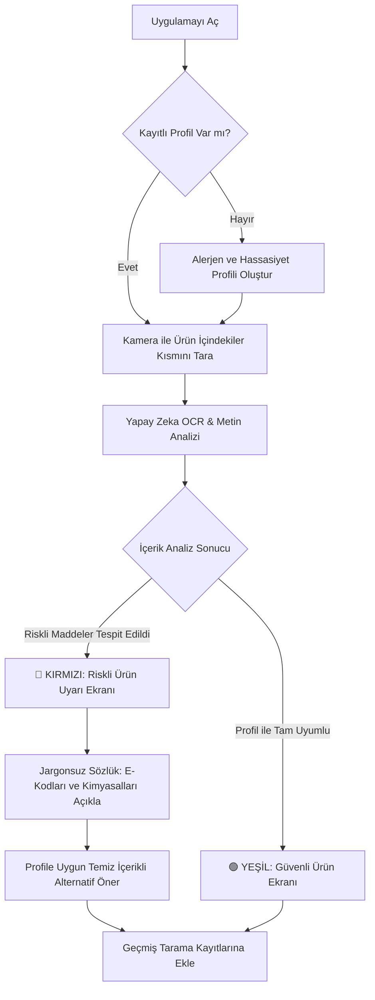
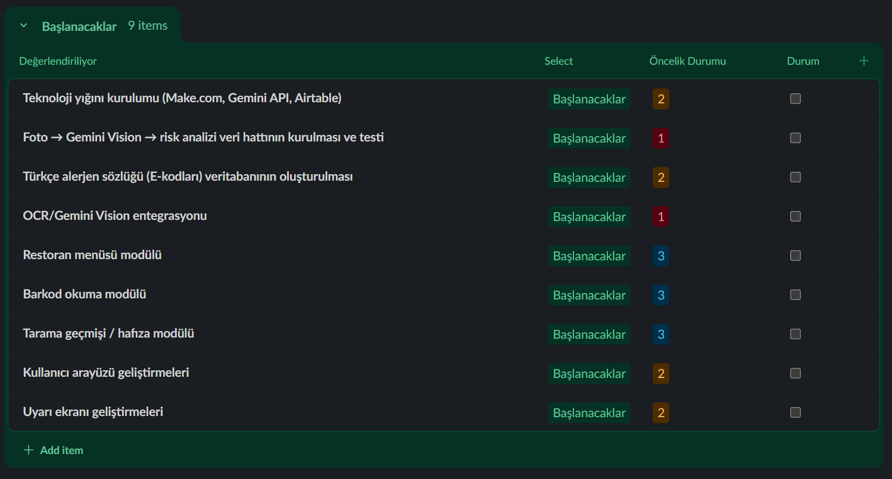

# NutriLens AI

*Güvenli Gıda, Bilinçli Tüketim.*

---

  
<b>👥 Ekip Üyeleri ve Rol Dağılımı</b>

   

| İsim | Rol | LinkedIn | GitHub |
| :--- | :--- | :---: | :---: |
| **Ünal Pilavcı** | Product Owner |  |  |
| **Nisa Gündüz** | Scrum Master |  |  |
| **Gülşah Cihanker** | No Code Low Code Developer |  |  |
| **Mehmet Fatih Efe** | No Code Low Code Developer |  |  |
| **Emine Beyza Demirbaş** | No Code Low Code Developer |  |  |

  
<b>💡 Ürün Bilgileri</b>

   

  ### 📌 Ürün İsmi
  **NutriLens AI**

  

  ### 📝 Ürün Açıklaması

  > 🔴 **⚠️ PROBLEM**
  >
  > Market raflarındaki paketli ürünlerin arkasındaki içindekiler listeleri genellikle mikroskobik puntolarla, Latince kimyasal isimlerle ve karmaşık E-kodlarıyla doludur. Çölyak, laktoz intoleransı veya kuruyemiş alerjisi olan bireyler; çocuğuna temiz içerikli gıda yedirmek isteyen ebeveynler; sporcular ve diyet yapanlar için bu etiketleri her seferinde okumak hem zaman kaybettirir hem de hata payı bazı durumlarda hayati risk taşır. Piyasadaki barkod okuyucu uygulamalar ise ürün kendi veritabanlarında kayıtlı değilse çalışmaz veya sadece kalori/makro bilgisiyle sınırlı kalır.

   

  > 🟢 **✅ ÇÖZÜM**
  >
  > NutriLens AI, ürünün “İçindekiler” kısmının fotoğrafını yapay zeka ile saniyeler içinde analiz eden bir mobil uygulamadır. Kullanıcı kendi alerjen ve hassasiyet profilini (gluten, laktoz, MSG, palm yağı vb.) bir kez oluşturur; sonrasında herhangi bir üründe kamerayla tarama yaptığında uygulama anında **KIRMIZI (Riskli)** veya **YEŞİL (Güvenli)** uyarısı verir ve karmaşık kimyasal isimleri/E-kodlarını sade bir dille açıklar. Üstelik uygulama, riskli bulunan (kırmızı) ürünlerin yerine kullanıcının profiline tam uyum sağlayan temiz içerikli alternatif ürün önerileri sunarak alışveriş deneyimini kesintisiz ve güvenli bir çözüme kavuşturur.

  

  ### ⚙️ Ürün Özellikleri

  | 🧩 Özellik | 📄 Açıklama / Teknoloji |
  | :--- | :--- |
  | 👤 **Kişiselleştirilmiş Profil** | Alerjen/hassasiyet profili oluşturma (gluten, laktoz, MSG, palm yağı vb.) |
  | 📷 **Anlık Tarama** | Kamera ile içindekiler listesini tarama (Vision AI + OCR) |
  | 🚦 **Renk Kodlu Uyarı** | Renk kodlu sonuç ekranı (🔴 Kırmızı: Riskli / 🟢 Yeşil: Güvenli) |
  | 📖 **Jargonsuz Sözlük** | E-kodları ve kimyasal isimleri sade dilde açıklama |
  | 🕓 **Geçmiş Kayıtlar** | Geçmiş tarama kayıtlarını saklama |

  

  ### 🎯 Hedef Kitle

  | 👥 Kitle | 🔎 Açıklama |
  | :--- | :--- |
  | 🥜 **Alerji & İntolerans** | Gıda alerjisi ve intoleransı olan bireyler (çölyak, laktoz, kuruyemiş vb.) |
  | 👨‍👩‍👧 **Bilinçli Ebeveynler** | Çocuklarının beslenmesini takip eden ebeveynler |
  | 🏋️ **Sporcular** | Sporcular ve fitness tutkunları |
  | 🥗 **Diyet & Kilo Yönetimi** | Ketojenik, vegan, vejetaryen vb. süreçtekiler |
  | 🌿 **Temiz Beslenme** | Clean eating odaklı tüketiciler |
  | 📚 **Gıda Okuryazarları** | 15 - 65 yaş arası gıda okuryazarlığına önem veren geniş kitle |

  

  ### 🗺️ Kullanıcı Akış Şeması (User Journey)
  

  
<b>🚀 Sprint 1</b>

   

  - **Backlog düzeni ve Story seçimleri:** Backlog oluşturulurken ekipteki geliştiricilerin görüşleri esas alındı ve uygulamanın çalışır bir MVP haline gelebilmesi için olmazsa olmaz kabul edilen temel akış netleştirildi: profil oluşturma, kamera ile tarama, OCR analizi ve uyarı ekranı. Proje toplamda üç sprintlik bir süreç olarak planlandığından ve henüz ekibin gerçek iş temposu test edilmediğinden, ilk sprintte temkinli davranılarak backlog'un yaklaşık üçte biri kadarlık bir kısmının alınması tercih edildi. Bu kapsamda Sprint 1'e, projenin iskeletini oluşturan story'ler dahil edildi: profil ekranı, kamera entegrasyonu ve Gemini API üzerinden OCR bağlantısı. Sprint 1 sonunda ekibin gösterdiği performans doğrultusunda, kalan sprintlerdeki görev yoğunluğu artırılabilir ya da mevcut planlamanın dışına çıkılarak ileriki sprintlere ait bazı story'ler öne çekilebilir.

  - **🔗 Product Backlog URL:** [Slack Product Backlog Board](https://yzta.slack.com/lists/T02LKGXV98C/F0BF5A5TXNZ) 

   

  **🖼️ Product Backlog Ekran Görüntüleri**

  

    
  

  

  

    
  

  

  

    
  

   

   

  **📋 Sprint 1 Daily Scrum Notları (17 GÜN)**

  | Gün | Tarih | Açıklama |
  |-----|-------|----------|
  | 1. GÜN | 19 Haziran 2026 |  Başlangıç yayını izlendi. Karar süreçlerini hızlandırmak amacıyla tüm proje fikirleri kolektif bir listede toplandı; rol dağılımı konuşuldu. Engel: Yok. |
  | 2. GÜN | 20 Haziran 2026 |  Proje fikirleri havuzu oluşturuldu (FonRadar, AgentShield, alerjen asistanı vb.). Ekip rollerini netleştirmek ve öne çıkan fikirleri değerlendirmek üzere bir araya gelindi. Engel: Yok. |
  | 3. GÜN | 21 Haziran 2026 |  Ekip rolleri belirlendi; FonRadar (hibe/yatırım eşleştirme asistanı) ve AgentShield fikirleri değerlendirmeye alındı. İki fikrin teknik gereksinim ve zaman kısıtı analizleri yapıldı. Engel: Yok. |
  | 4. GÜN | 22 Haziran 2026 |  Teknik gereksinim analizleri tamamlandı. FonRadar'ın veri katmanı (KOSGEB/TÜBİTAK tarama, PDF ayrıştırma) ve AgentShield'in kapsamı mevcut süre/imkanlarla uyuşmadığından fikirlerin elenmesi değerlendirildi. Engel: Kritik: Değerlendirilen fikirler mevcut imkanlarla uyuşmuyor. |
  | 5. GÜN | 23 Haziran 2026 |  FonRadar ve AgentShield fikirleri elendi, NutriLens AI (alerjen/hassasiyet güvenlik asistanı) fikrine karar verildi. NutriLens AI için Product Backlog taslağı hazırlandı. Engel: Yok. |
  | 6. GÜN | 24 Haziran 2026 |  Product Backlog taslağı hazırlandı. Sprint 1 panosu kuruldu, görev atamaları ve zorluk dereceleri belirlendi. Engel: Yok. |
  | 7. GÜN | 25 Haziran 2026 |  Görev atamaları tamamlandı. Proje mimarisi (profil → foto → Gemini Vision → risk analizi → uyarı ekranı akış şeması) tasarlandı; henüz uygulanmadı, yalnızca tasarım aşamasında. Engel: Yok. |
  | 8. GÜN | 26 Haziran 2026 |  Mimari akış şeması tasarlandı. MVP altyapısı için Softr / Bubble / Make karşılaştırması yapıldı; karar henüz verilmedi, değerlendirme sürüyor. Engel: Yok. |
  | 9. GÜN | 27 Haziran 2026 |  Altyapı karşılaştırma raporu hazırlandı. Teknoloji yığını (Make.com, Gemini API, Airtable) kurulumu ile veri hattının 2. aşamada yapılacak işler olarak listelenmesine karar verildi. Engel: Yok. |
  | 10. GÜN | 28 Haziran 2026 |  2. aşamada yapılacak işler (veri hattı, Türkçe alerjen sözlüğü, OCR/Gemini Vision entegrasyonu, barkod ve restoran menüsü modülleri) netleştirildi. Ekip içi senkronizasyonu korumak ve kapsamın dışına çıkılmasını (feature creep) önlemek için hizalanma toplantısı yapıldı. Engel: Kapsamın çok genişleme riski (Önlem alındı). |
  | 11. GÜN | 29 Haziran 2026 |  Kapsam sınırları netleştirildi (barkod ve restoran menüsü modülleri sonraki aşamalara ertelendi). Sunum dosyası için ön taslaklar hazırlandı. Sprint Review ve Retrospective tarihleri planlandı. Engel: Yok. |
  | 12. GÜN | 30 Haziran 2026 |  Sunum taslakları hazırlandı. Product Backlog gözden geçirildi ve düzenlendi. Engel: Yok. |
  | 13. GÜN | 1 Temmuz 2026 |  Product Backlog düzenlendi. Sprint 2'de yapılacak işler (teknoloji yığını kurulumu, veri hattı, alerjen sözlüğü, arayüz ve uyarı ekranı geliştirmeleri) belirlenip önceliklendirildi. Engel: Yok. |
  | 14. GÜN | 2 Temmuz 2026 |  Sprint 2 iş kalemleri belirlendi. Sprint 1 kapatılmadan önce panoların son senkronizasyon kontrolleri yapıldı. Engel: Yok. |
  | 15. GÜN | 3 Temmuz 2026 |  Panolar senkronize edildi. Sprint 1'in kapanışı için Review ve Retrospective toplantıları yapıldı. Engel: Yok. |
  | 16. GÜN | 4 Temmuz 2026 |  Review ve Retrospective toplantıları yapıldı. Repository düzenlendi (klasör/doküman yapısı — kod değil) ve Sprint 1 kapatıldı. Engel: Yok. |
  | 17. GÜN | 5 Temmuz 2026 |  Repo düzenlenerek Sprint 1 kapatıldı. Sprint 2 görevleri planlanarak board'a eklendi; geliştirme çalışmaları Sprint 2'de başlayacak şekilde bırakıldı. Engel: Yok. |

   

 
  - **Ürün Durumu:** 

  
  - **Sprint Review:** - Kullanıcının kamerayla çektiği ürün içindekiler fotoğrafını otonom olarak işleyip, Gemini AI ile OCR ve risk analizi yaparak kırmızı/yeşil sonucu üreten çalışan bir MVP veri hattı kurmak.
    - Sprint Review katılımcıları: Ünal Pilavcı, Nisa Gündüz, Gülşah Cihanker, Mehmet Fatif Efe, Emine Beyza Demirbaş
  - **Sprint Retrospective:**

Sprint 1, bir kod geliştirme sprint’inden çok bir yön belirleme ve planlama sprint’i olarak geçti. Ekip, Ghost Roas, FonRadar ve AgentShield gibi alternatif proje fikirlerini değerlendirdikten sonra NutriLens AI üzerinde karar kıldı; bu süreç beklenenden biraz daha uzun sürdü çünkü her fikrin hedef kitle ve teknik uygulanabilirlik açısından ayrı ayrı tartışılması gerekti. Karar netleştikten sonra backlog taslağı, sprint panosu ve görev dağılımı hızlıca oluşturuldu, bu da ekibin fikir aşamasından planlama aşamasına geçişte iyi bir tempo yakaladığını gösterdi.

MVP altyapısı konusunda (Softr / Bubble / Make karşılaştırması) henüz kesin bir karara varılmadı; bu, Sprint 2'nin ilk gününde çözülmesi gereken açık bir konu olarak kaldı. Proje mimarisi (akış şeması) tasarım aşamasında tamamlandı ancak henüz uygulamaya geçirilmedi, dolayısıyla teknik entegrasyonun (Make.com, Gemini API, Airtable) gerçek zamanlı davranışı hakkında henüz bir öngörümüz yok — bu da Sprint 2'nin en kritik risk alanı olarak değerlendirildi.

Ekip, MVP kapsamını olabildiğince sade tutma eğiliminde; barkod okuma, restoran menüsü ve tarama geçmişi gibi özellikler şimdilik ikinci öncelik olarak değerlendiriliyor. Ancak bu konudaki kapsam kararı henüz kesinleşmedi — Sprint 2'de ekip, çekirdek akışın (foto → analiz → sonuç) ne kadar hızlı oturduğuna bağlı olarak bu özelliklerden bazılarını erken devreye almayı da değerlendirebilir.

**Sprint 2 için öncelik:** MVP altyapı seçiminin ilk 1-2 gün içinde kesinleştirilmesi ve foto → Gemini Vision → risk analizi veri hattının en azından uçtan uca çalışan bir prototip olarak test edilmesi.
    

  
<b>🚀 Sprint 2</b>

   
  
  

Sprint Türü: Geliştirme Sprinti (Development-only) — Bu sprintte ayrı bir tasarım/araştırma fazı yürütülmemiş, doğrudan ürün geliştirmesi yapılmıştır. Sprint Süresi: 15 gün (6 Temmuz – 20 Temmuz 2026). Platform: React Native (Expo SDK 54) mobil uygulama.
Sprint Hedefi (Sprint Goal): Prototip iskeletini; gerçek AI analizi yapan, kullanıcı verisini bulutta güvenle saklayan ve sosyal bir topluluk katmanı içeren, mağazaya yakın (store-ready) bir mobil ürüne dönüştürmek. Bu hedef üç damara ayrıldı: Deneyim (UX/UI) — yeni tasarım sistemi ve tüm ana ekranların canlı, animasyonlu hâle getirilmesi; Zekâ (AI/Analiz) — foto → madde → skor → kişisel uyarı hattının uçtan uca çalışması; Altyapı (Backend) — Supabase üzerinde auth, veri kalıcılığı, topluluk ve offline senkron.
Backlog düzeni ve Story seçimleri: Sprint 1'de ekibin gerçek iş temposu henüz test edilmediğinden temkinli davranılmış ve backlog'un yaklaşık üçte biri alınmıştı. Sprint 2'de bu tempo doğrulandığı için backlog'un ağırlıklı kısmı bu sprinte çekildi. Backlog MoSCoW (Must / Should / Could / Won't) yöntemiyle önceliklendirildi, her Epic kullanıcı hikâyelerine bölündü ve ekip içi efor tahmini Story Point (Fibonacci: 1-2-3-5-8-13) ile yapıldı. "Must" kategorisindeki tasarım sistemi, tarama/AI hattı, kimlik-profil ve backend epic'leri zorunlu kapsam olarak alındı; topluluk ve çoklu dil epic'leri "Should" olarak seçilmesine rağmen sprint içinde tamamlanabildi. FastAPI backend'e taşıma, admin panel, push bildirim ve barkod tarama bilinçli olarak kapsam dışı ("Won't") bırakıldı.
Sprint içi puan değerlendirmesi 16 olarak belirlenmiştir.
Puan tamamlama mantığı: Proje boyunca tamamlanması gereken backlog puanı 36'dır. Sprint 1'de hedeflenen 10 puan tamamlanmıştır. Sprint 1 ağırlıklı olarak fikir seçimi ve planlama ile geçtiğinden geliştirmenin ana yükü Sprint 2'ye bindirilmiş ve kalan 26 puanın 16'sı bu sprinte alınmıştır. Sprint 2 sonunda 16 puanın tamamı tamamlanmış ve hedefe ulaşılmıştır. Sprint 3'e doğrulama, güvenlik testleri ve sağlamlaştırma işleri için 10 puan bırakılmıştır.

   
📊 Sprint 2 Puan Tablosu

EpicKapsamÖncelikPuanDurum🎨 EPIC 1Tasarım Sistemi & Görsel KimlikMust3✅ Tamamlandı📸 EPIC 2Tarama & AI AnaliziMust4✅ Tamamlandı👤 EPIC 3Kimlik, Profil & OnboardingMust2✅ Tamamlandı☁️ EPIC 4Backend & Veri Kalıcılığı (Supabase + RLS)Must3✅ Tamamlandı🌐 EPIC 5Topluluk & KeşfetShould3✅ Tamamlandı🌍 EPIC 6Erişilebilirlik & Çoklu DilShould1✅ TamamlandıTOPLAM16✅ 16 / 16

   
📈 Proje Geneli Puan Dağılımı

SprintHedeflenen PuanTamamlananKümülatifDurumSprint 1101010 / 36✅ Hedefe ulaşıldıSprint 2161626 / 36✅ Hedefe ulaşıldıSprint 310—36 / 36⏳ Planlandı

   
📋 Sprint 2 Story Listesi (Ekip İçi Efor Tahmini)

Aşağıdaki SP değerleri ekip içi Fibonacci efor tahminini gösterir (toplam ~110 SP); bootcamp puanlaması ise yukarıdaki 36'lık ölçeğe normalize edilmiştir.

IDUser StoryEpicSPDurumNL-01Bir kullanıcı olarak, modern ve tutarlı bir arayüz istiyorum ki uygulamaya güven duyayım.18✅ DoneNL-02Kullanıcı olarak koyu/açık tema seçebilmek istiyorum ki göz konforum korunsun.15✅ DoneNL-03Yeniden kullanılabilir bileşen kütüphanesi (kart, buton, rozet, skor halkası) istiyorum.15✅ DoneNL-04Kullanıcı olarak ürün etiketini fotoğraflayıp içindekileri okutmak istiyorum.28✅ DoneNL-05Kullanıcı olarak her maddenin benim için güvenli/hassas/riskli olduğunu görmek istiyorum.28✅ DoneNL-06Kullanıcı olarak ürünün 0–100 sağlık skorunu ve A–E notunu görmek istiyorum.25✅ DoneNL-07Kullanıcı olarak E-kodlarının sade açıklamasını (Şeffaf Sözlük) görmek istiyorum.23✅ DoneNL-08Kullanıcı olarak e-posta ile kayıt olup giriş yapmak istiyorum.35✅ DoneNL-09Kullanıcı olarak alerji/hassasiyet/diyet profilimi adım adım kurmak istiyorum.38✅ DoneNL-10Kullanıcı olarak profilimi sonradan düzenlemek istiyorum.35✅ DoneNL-11Kullanıcı olarak verilerimin bulutta saklanıp başka cihazda da görünmesini istiyorum.48✅ DoneNL-12Kullanıcı olarak internetim yokken de geçmiş taramalarımı görebilmek istiyorum.45✅ DoneNL-13Kullanıcı olarak sağlık verilerimin yalnızca bana ait olduğuna (RLS) güvenmek istiyorum.45✅ DoneNL-14Kullanıcı olarak hesabımı ve tüm verilerimi silebilmek istiyorum (KVKK/GDPR).43✅ DoneNL-15Kullanıcı olarak taradığım ürünü toplulukla paylaşmak istiyorum.58✅ DoneNL-16Kullanıcı olarak gönderileri beğenmek, yorum yapmak ve kaydetmek istiyorum.55✅ DoneNL-17Kullanıcı olarak başka kullanıcıları takip edip profillerini görmek istiyorum.55✅ DoneNL-18Kullanıcı olarak beslenme/sağlık blog yazılarını okumak istiyorum.53✅ DoneNL-19Kullanıcı olarak uygulamayı Türkçe veya İngilizce kullanmak istiyorum.65✅ DoneNL-20Kullanıcı olarak gizlilik/yasal metinlere ve ayarlara ulaşmak istiyorum.63✅ Done

Won't (bu sprint dışı bırakılanlar): FastAPI backend'e taşıma, Admin Panel (Next.js), push bildirim, "Spor/Fitness" sekmesi içeriği, barkod tarama.

🔗 Product Backlog URL: Slack Product Backlog Board

   
🖼️ Sprint 2 Board Ekran Görüntüleri

  

    
  

  

  

    
  

   
   
🛠️ Kullanılan Teknoloji Yığını

KatmanTeknolojiGörevÇatıReact Native 0.81 + Expo SDK 54 + Expo Router 6Mobil uygulama, dosya-tabanlı yönlendirmeDilTypeScript 5.9Tip güvenliğiStilNativeWind v4 (Tailwind CSS v3.4)Utility-first stillendirmeAnimasyonMoti + Reanimated 4Mikro-etkileşim, stagger, springİkon / Grafiklucide-react-native, react-native-svg, Skiaİkonlar, skor halkası, nabız çizgisiDurum YönetimiZustand 5 (+ AsyncStorage persist)İstemci durumu ve kalıcılıkBackendSupabase (Postgres + Auth + RLS)Kimlik, veri, topluluk, blogAI / VisionGroq API (Llama 4 Scout) — değiştirilebilir sağlayıcıFoto → madde çıkarımıÇoklu Dili18next + expo-localizationTR / ENFontlarSpace Grotesk + DM Sans (@expo-google-fonts)Tipografi

   
🎨 Tasarım Sistemi — Tema, Renk ve Font Kararları

Stil yönü "NutriLens Fresh Minimal" olarak belirlendi: neredeyse siyah/beyaz nötrler üzerine tek canlı vurgu (lime). Sprint 2'de eski "organik yeşil" kimlik emekliye ayrıldı.

RolHexKullanımLime / Accent#DFFB4BScan FAB, birincil buton, bildirim rozeti, aktif vurguonLime (metin)#0C0F0CLime dolgu üzerindeki metin/ikon

NötrlerAçık TemaKoyu TemaArka plan#FDFDFB#0C0F0CYüzey / Kart#F1F3EE#161B15Metin#101410#F4F6F1Sönük metin#7A857A#8A928AKenarlık#E7E9E3#232B22

Sağlık skoru için trafik ışığı sistemi bilinçli olarak korundu; kötü skorun görsel olarak uyarması gerektiği için lime'a çevrilmedi:

NotAralıkRenkAnlamA80–100#2FA34BMükemmelB65–79#84BB2EİyiC45–64#E6B325OrtaD25–44#E67E2EZayıfE0–24#DB4C40Kaçının

Madde etiketi renkleri: 🟢 Güvenli #7CB342 · 🟡 Hassas #F5A623 · 🔴 Riskli #E24C4C · 🔵 Bilgi #4E7C59

Erişilebilirlik kuralı: Renk asla tek başına anlam taşımaz — her etikette ikon + metin bulunur.

Tipografi: Başlıklar Space Grotesk (500/600/700), gövde metni DM Sans (400/500/700). Type scale: display 44 · h1 28 · h2 22 · h3 18 · body 16 · label 14 · caption 12 px.

Bileşen kütüphanesi (9 parça): card, pill, pressable-scale, reveal, score-ring, animated-number, skeleton, primary-button, pulse-line

   
📱 Oluşturulan Ekranlar (30+ Rota)

AkışEkranlarKimlik & OnboardingGiriş, Şifremi Unuttum, Kayıt: Hesap → Alerjenler → Rahatsızlıklar → Hassasiyetler → Diyetler → TamamAna Uygulama (Tab)Ana Sayfa, Spor/Fitness (placeholder), Keşfet (Topluluk + Blog), ProfilTarama & AnalizTarama (kamera), Sonuç, Geçmiş, Şeffaf Sözlük, Madde Detayı, Günün İpucuToplulukGönderi Paylaş, Yorumlar, Topluluk Profili, Profil Düzenle, Blog YazısıProfil & AyarlarRahatsızlık / Alerjen / Hassasiyet / Diyet / Vücut Bilgisi düzenleme, Ayarlar, Gizlilik

   
   
📋 Sprint 2 Daily Scrum Notları (15 GÜN)

GünTarihAçıklama1. GÜN6 Temmuz 2026Sprint 1'den devreden MVP altyapı kararı kapatıldı: Softr / Bubble / Make hattı yerine, kamera ve gerçek zamanlı AI analizi gereksinimini karşılayabilmek için React Native (Expo) + Supabase yığınına geçilmesine karar verildi. Sprint Planning tamamlandı; backlog MoSCoW ile önceliklendirilerek 20 story seçildi. Engel: tailwindcss v4 geliyor, NativeWind v4 için v3'e pinlenmesi gerekti (çözüldü).2. GÜN7 Temmuz 2026babel/metro/tailwind config ve global.css kuruldu; Space Grotesk ile DM Sans fontları yüklendi. Renk token mimarisine geçildi. Engel: İki toolchain arası token senkronu manuel, yordam belirlendi.3. GÜN8 Temmuz 2026"Fresh Minimal" siyah + lime paleti kuruldu; açık/koyu tema tokenları tamamlandı. UI bileşen kütüphanesine başlandı (card, pill, button, score-ring). Engel: Yok.4. GÜN9 Temmuz 2026UI bileşenleri tamamlandı (reveal, skeleton, pressable-scale, animated-number, pulse-line) ve Moti animasyonları eklendi. Ana Sayfa geliştirmesine geçildi. Engel: MotiPressable layout tuzağı, pattern belirlenerek çözüldü.5. GÜN10 Temmuz 2026Ana Sayfa (hero kart, hızlı erişim, son taramalar) ve özel Scan FAB'lı alt navigasyon barı tamamlandı. Tarama ekranına geçildi. Engel: Yok.6. GÜN11 Temmuz 2026Kamera tarama akışı ve görüntü ön işleme (kırp/sıkıştır) tamamlandı. Vision provider katmanı iskeleti kuruldu. Engel: Groq API anahtarı şimdilik istemcide; prototip kısayolu olarak kabul edildi, teknik borç kaydı açıldı.7. GÜN12 Temmuz 2026Groq (Llama 4 Scout) ile foto → madde çıkarımı çalışır hâle geldi; prompt, parse ve hata yönetimi modülleri yazıldı. Engel: Yok.8. GÜN13 Temmuz 2026Deterministik sağlık skoru motoru (işlenme %40 + katkı %35 + besin %25) ve alerjen eşleştirme kural motoru yazıldı; Sonuç ekranı tamamlandı. Engel: Yok.9. GÜN14 Temmuz 2026Şeffaf Sözlük ve madde detay sayfası tamamlandı; Geçmiş ekranı geliştirildi. Engel: Yok.10. GÜN15 Temmuz 2026Çok adımlı kayıt akışı (hesap → alerjenler → rahatsızlıklar → hassasiyetler → diyetler → tamam) ve profil seçim çipleri tamamlandı. Supabase şema çalışmasına geçildi. Engel: Panelde "Confirm email" açık olursa kayıt akışı takılıyor, kapalı olmalı (not düşüldü).11. GÜN16 Temmuz 2026Supabase Auth entegrasyonu tamamlandı; oturum bayrağı doğrudan oturumdan türetilerek kalıcı bayrak sızıntısı giderildi. Engel: Yok.12. GÜN17 Temmuz 2026Offline-first tarama senkronu (idempotent UUID, merge / sunucu-kazanır) tamamlandı. Profil sunucu senkronuna geçildi. Engel: Yeni cihazda "register-flash" riski; profil sunucudan gelene kadar yönlendirme bekletilerek çözüldü.13. GÜN18 Temmuz 2026Profil düzenleme ekranları ve KVKK/GDPR hesap silme tamamlandı. Topluluk feed geliştirmesine başlandı. Engel: Yok.14. GÜN19 Temmuz 2026Topluluk feed, gönderi paylaşma, yorum ekranı, topluluk profili ve takip özellikleri tamamlandı. Engel: Yorum ekranında native davranış güvenilmez çalıştı, özel çizim ile çözüldü.15. GÜN20 Temmuz 2026Blog ve makale ekranı, tam TR/EN çeviri, Ayarlar ve Gizlilik ekranları tamamlandı; uçtan uca typecheck ve lint temizlendi. Sprint Review ve Retrospective yapıldı. Engel: Cihazda uçtan uca doğrulama (sızıntı + RLS testleri) Sprint 3'e devredildi.

   

Ürün Durumu:

  

    
    
    
  

  

    
    
    
  

   

Sprint Review: Sprint 2'de ürün, cihaz-yerel bir prototipten; gerçek bir bulut backend'ine (Supabase) bağlı, sosyal katmanlı ve çok ekranlı bir uygulamaya dönüştürüldü.

AlanÇıktıTasarımYeni "Fresh Minimal" kimliği, açık/koyu tema, 9 parçalık bileşen kütüphanesi, TR/ENTarama & AIKamera/galeri → Groq (Llama 4) → madde çıkarımı → skor → kişisel uyarı hattı çalışıyorEkranlar30+ ekran/rota (Ana Sayfa, Tarama, Sonuç, Geçmiş, Sözlük, Keşfet, Profil, Kayıt, Ayarlar)BackendSupabase auth + profil + tarama + topluluk + blog şeması, RLS güvenlik, 3 migrationOfflineOffline-first tarama senkronu (idempotent, merge)SosyalTopluluk feed, gönderi paylaş, beğeni/yorum/kaydet, takip, blog okuma

Hedeflenen 16 puanın tamamı tamamlandı (%100). Kümülatif ilerleme: 26 / 36 puan. Kod tarafında typecheck ve lint temiz. Definition of Done açısından kod yazıldı, typecheck ve lint geçti, tema/dil desteği ekranlarda tutarlı; ancak cihazda uçtan uca doğrulama (özellikle Supabase sızıntı ve RLS testleri) henüz yapılmadı ve Sprint 3'ün ilk maddesi olarak devredildi.

Bu sprintte kodu yazılan ancak doğrulanmayan ya da bilinçli olarak sonraya bırakılan işler: cihazda uçtan uca test, Supabase sızıntı ve RLS güvenlik testleri, bekleyen migration'ların panelde çalıştırılması, "Confirm email" ayarının doğrulanması, AI çağrısının backend'e taşınması, Gemini sağlayıcısının bağlanması, Spor/Fitness sekmesi içeriği, push bildirim altyapısı, blog besleme hattı, otomatik birim testler ve tarama görsellerinin kalıcı depolamaya yüklenmesi.

- Sprint Review katılımcıları: Ünal Pilavcı, Nisa Gündüz, Gülşah Cihanker, Mehmet Fatih Efe, Emine Beyza Demirbaş

Sprint Retrospective:

Sprint 2, Sprint 1'in aksine tamamen bir geliştirme sprint'i olarak geçti ve seçilen 20 story'nin tamamının kodu tamamlandı. En çok işe yarayan karar, değiştirilebilir mimari tercihi oldu: vision provider katmanı sayesinde Groq → Gemini geçişi tek dosyalık bir işe indi, ekran → store → client sınırı ise backend'i uygulamanın geri kalanından izole etti. Yeni tasarım sistemi hızla oturdu ve bileşen kütüphanesi sonraki ekranların yapım hızını gözle görülür şekilde artırdı.

Güvenlik tarafında alerjen eşleştirmenin yapay zekâya bırakılmayıp deterministik bir kural motoruyla yapılması ve sağlık verisinin RLS ile yalnızca sahibine açılması, geri dönülmesi zor olacak doğru kararlar olarak değerlendirildi. Topluluk gönderilerinin yalnızca uyarı sayısını taşıması, hangi uyarının alındığını asla herkese açık yazmaması da bu gizlilik ekseninin bir parçası oldu.

Sprintin en net dersi ise şu oldu: "kod bitti" ile "done" aynı şey değil. Tüm fonksiyonellik yazıldı ancak cihazda uçtan uca doğrulama sprint içine sığmadı; bu nedenle Definition of Done'a "cihaz testi" zorunlu bir adım olarak eklenecek. Ayrıca toolchain kaynaklı tuzaklar beklenenden fazla zaman kaybettirdi — bunlar artık dokümante edildiği için tekrarlanmayacak. Groq API anahtarının hâlâ istemcide durması bilinçli kabul edilmiş, ancak yayına çıkmadan önce mutlaka kapatılması gereken bir teknik borç olarak kayda geçti.

Retro oylaması: Hız 🟢 Yüksek · Kalite 🟡 Orta (cihaz doğrulaması eksik) · Takım Morali 🟢 Yüksek

#AksiyonSorumlulukNe zaman1Cihazda uçtan uca test (sızıntı testi: A çıkış → B giriş; RLS testi: B token'ıyla A verisi = 0 satır)GeliştirmeSprint 3 başı2Bekleyen migration'ları Supabase panelinde çalıştır, "Confirm email" kapalı doğrulaGeliştirmeSprint 3 başı3Definition of Done'a "cihaz doğrulaması" zorunlu maddesi ekleEkipSprint 3 Planning4AI çağrısını backend'e (FastAPI / Supabase Edge Function) taşıma planıGeliştirmeSprint 3 backlog5Skor ve alerjen motorları için otomatik birim testleriGeliştirmeSprint 3

Sprint 3 için öncelik: Yazılan bu geniş fonksiyonelliğin cihazda uçtan uca doğrulanması, güvenlik (sızıntı + RLS) testlerinin tamamlanması ve AI anahtarının istemciden çıkarılması.
  
<b>🚀 Sprint 3</b>

   
(Sprint 3 notları, ekran görüntüleri ve toplantı detayları bu alana eklenecektir.)

  This project was developed with ❤️. If you like our vision, feel free to support us by leaving a Star (⭐)!

  

  
<b>🚀 Sprint 3</b>

   
  
  *(Sprint 3 notları, ekran görüntüleri ve toplantı detayları bu alana eklenecektir.)*
  

  This project was developed with ❤️. If you like our vision, feel free to support us by leaving a Star (⭐)!

